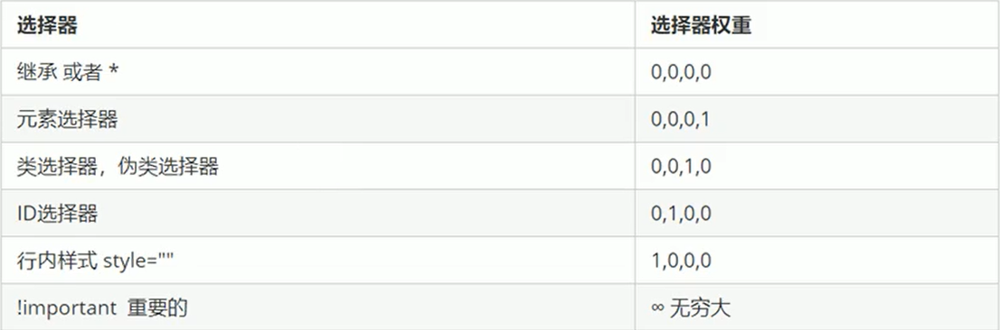
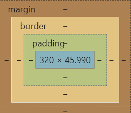
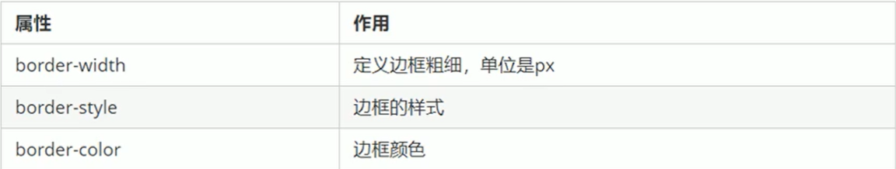
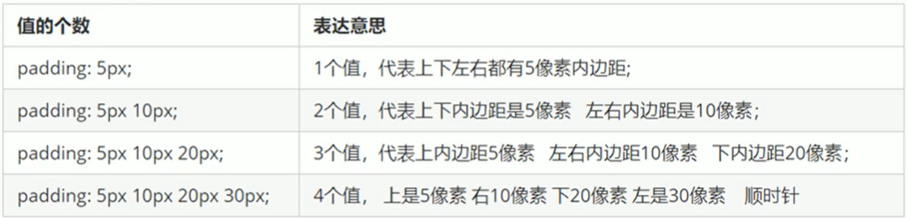

# CSS-3
## CSS的三大特性
### 层叠性
* 相同选择器给设置相同的样式，此时一个样式就会<font color="red">覆盖（层叠）</font>另一个冲突的样式。层叠性主要解决样式冲突的问题。
```html
div {
	color: red;
}
div {
	color: pink;
}
```
层叠性的原则：
* 样式冲突，遵循的原则是就近原则，哪个样式离结构近，就执行哪个如上
* 样式不冲突，不会层叠如下，font-size不会被重叠
```html
div {
	color: red;
	font-size: 12px;
}
div {
	color: pink;
}
```
### 继承性
CSS的继承：子标签会继承父标签的<font color="red">某些样式</font>，如文本颜色和色号。简单的理解就是：子承父业。
* 恰当地使用继承可以简化代码，降低CSS样式的复杂性
* 子元素可以继承父元素的样式（text-，font-，line-这些元素开头的可以继承，以及color属性）<font color="red">跟文字相关的</font>
==行高的继承==
```html font：12px/24px 'Microsoft 'YaHei'```
24是指行高,带了单位
```html font：12px/1.5 'Microsoft 'YaHei'```
1.5是指**行高是字号1.5倍**,不带单位
这个行高是当前元素文字大小的1.5倍，比如在后面我们对font-size进行了层叠覆盖，我们会按最新的字体大小计算行高
### 优先级
当同一个元素指定多个选择器，就会有优先级的产生。
* 选择器相同，则执行层叠性
* 选择器不同，则根据选择器权重执行

```html
div {
	color: red;
}
.text {
	color: pink;
}
#demo {
	color: green;
}
<div class="test" id="demo" style="color: purple">棒</div>
```
元素选择器<类选择器（伪类选择器）<id选择器<行内式style=""<!important中昂要的
比如：
```html
div {
	color: red;
}
.text {
	color: pink ！important;
}
#demo {
	color: green;
}
<div class="test" id="demo" style="color: purple">棒</div>
```
会呈现粉色
* 但是：==继承的权重是0==，如果该元素没有直接被选中，不管父元素权重多高，子元素得到的权重都是0。
* <font color="red">a链接特殊，a链接浏览器指定了一个样式蓝色下划线，相当于单独选出了，优先级高于继承</font>
**==注：==**
1. 权重叠加：如果是复合选择器，则会有权重叠加，需要计算权重。但是永远不会有进位。
```
ul li {
	color：green;
}
.nav li {
	color：green;
}
```
ul li 权重 0,0,0,1+0,0,0,1=0,0,0,2;.nav li 权重 0,0,1,0+0,0,0,1=0,0,1,1后者大
## CSS盒子模型
页面布局要学习三大核心，盒子模型，浮动和定位。
### 看透网页布局的本质
边框+内边距+外边距+实际内容
* 网页布局过程：
1. 先准备好相关网页元素，网页元素基本都是盒子
2. 利用CSS设置好盒子样式，然后摆放到相应的位置。
3. 网盒子里面装内容。
* 网页布局的核心本质：就是利用CSS摆盒子

#### 边框（boder）
boder可以设置边框，边框有三部分组成：边框宽度（粗细）边框样式 边框颜色

* boder-width一般都用px
* 边框的复合型写法：``` boder: 1px solid red;``` 没有顺序
* 边框分开写：
	* boder-top: 1px solid red;
	* boder-bottom: 1px solid blue;
	* boder-bottom: 1px solid blue;
	* boder-bottom: 1px solid blue;
```====等价于====```
	* boder: 1px solid blue;
	* boder-top: 1px solid red;
##### 细边框
* table和td都要有边框
* 由于边框的盒子和内部表格的盒子是分别添加的，所以它会重叠变粗
* ```boder-collapse```属性控制浏览器绘制边框的方式。他控制相邻单元格的边框。
* 语法：```boder-collapse:collapse;```
	* collapse单词是合并的意思
	* ```boder-collapse:collapse;```表示相邻边框合并在一起
##### 边框会影响盒子实际大小
边框会额外增加盒子实际大小。因此我们有两种方案解决:
1. 测量盒子大小的时候，不量边框。
2. 如果测量的时候包含边框，则需要width/height减去边框宽度。
#### 内边距
padding属性用预设值内边距，即边框与内容之间的距离。
|属性|作用|
|----|----|
|padding-left|左内边距|
|padding-right|右内边距|
|padding-top|上内边距|
|padding-bottom|下内边距|
* padding属性简写（特殊）：
